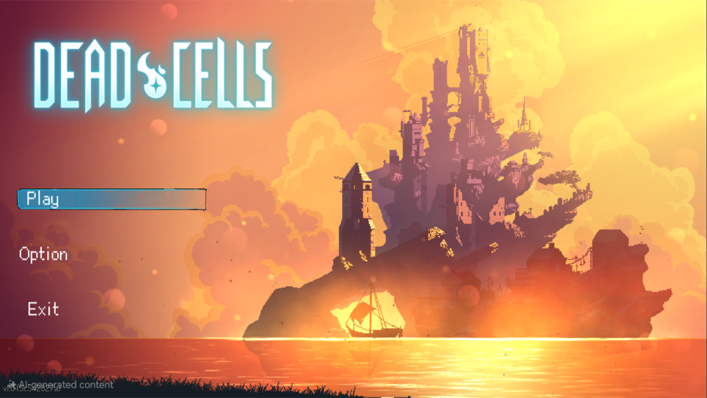
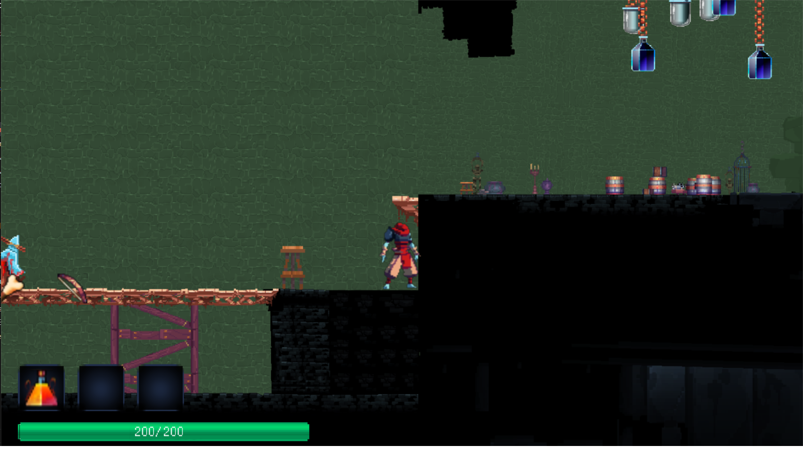
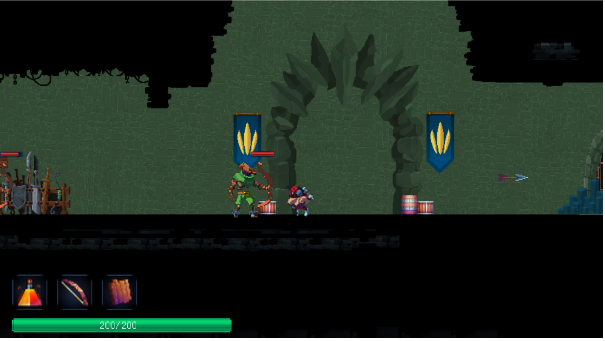
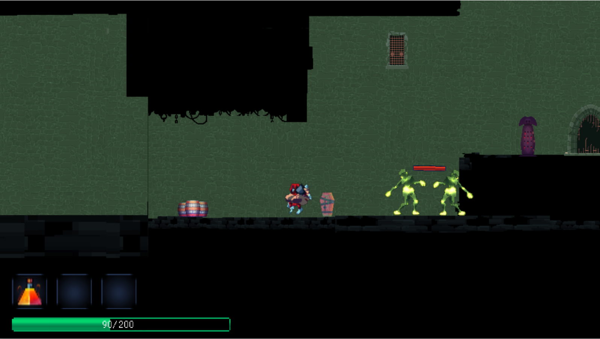
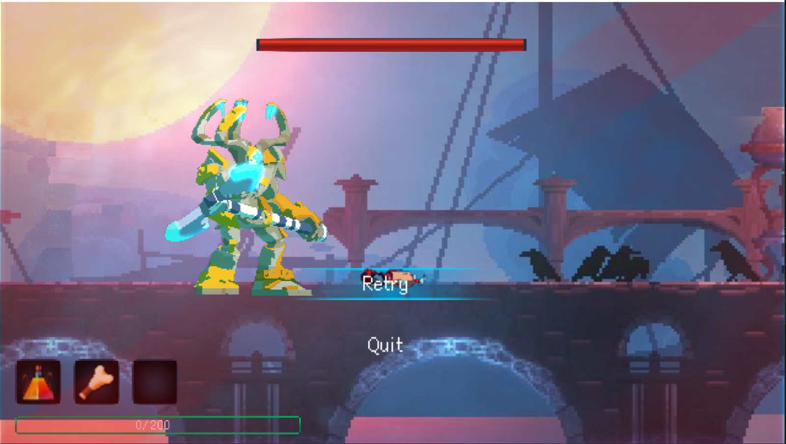
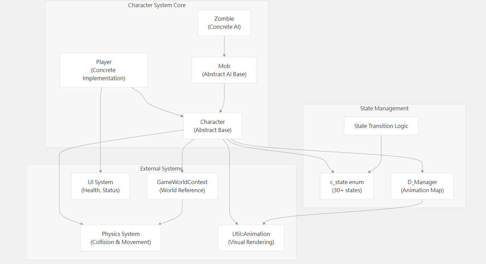
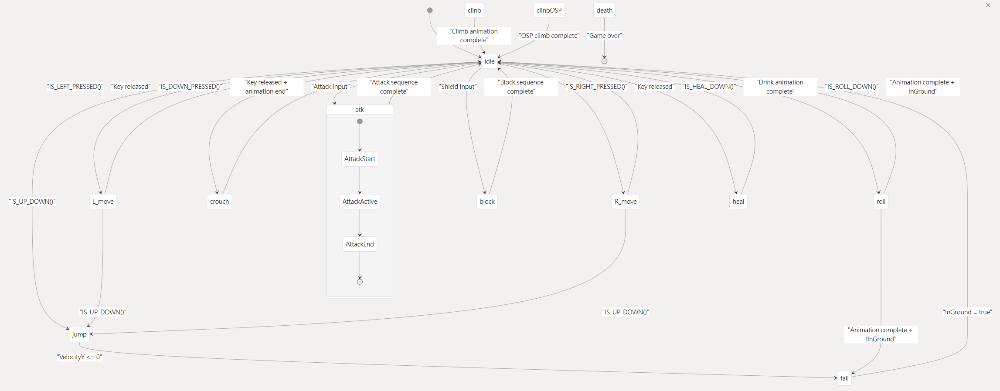
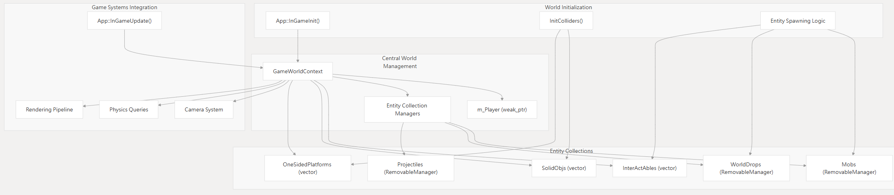
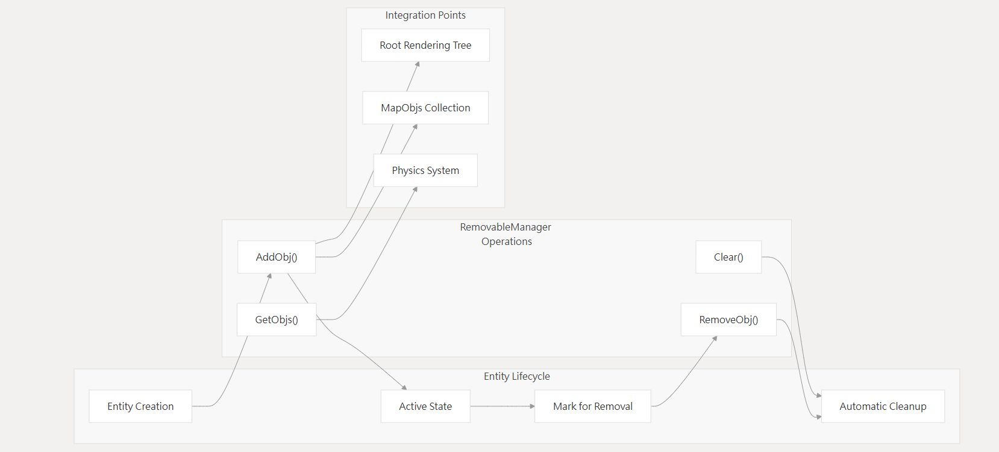

# NTUT 2025 OOPL Final Report

## 期末報告

**Dead Cells**

第15組  

黃力安、劉玉凱

---

## 目錄

1. 專案簡介  
    1. 遊戲簡介
2. 遊戲介紹  
    1. 遊戲規則  
    2. 遊戲畫面
3. 程式設計  
    1. 程式架構  
    2. 程式技術
4. 結語  
    1. 問題及解決方法  
    2. 貢獻比例  
    3. 自我檢核表  
    4. 收穫  
    5. 心得、感想  
    6. 對於本課程的建議

---

## 一、專案簡介

### 1. 遊戲簡介

《死亡細胞》（Dead Cells）是一款結合 Roguelike 與類銀河戰士惡魔城要素的遊戲。玩家扮演一個被不明細胞寄生的屍體，在地牢中探索尋找出路。途中會遇到各式武器裝備、道具可供收集，但同時也需警惕陷阱與敵對生物。

### 2. 組別分工

- 黃力安：遊戲主程式設計，怪物 AI、戰鬥系統、UI 設計
- 劉玉凱：角色控制與地圖生成，報告

---

## 二、遊戲介紹

### 1. 遊戲規則
- 玩家初始生命值為 200，當生命值歸零時遊戲結束 AppInGameInit.cpp:16
- 可透過擊殺敵人或開啟寶箱獲得道具和武器
- 支援近戰武器（劍、盾）和遠程武器（弓箭）系統
- 具備翻滾閃避、攀爬、格擋等動作機制

### 2. 遊戲畫面

---

## 三、程式設計

### 1. 程式架構
角色架構為Abstruct class Character提供介面與、工具與基本資料宣告，同時將動畫與狀態機封裝，遊戲中所有角色都需要繼承它。  
Player就是繼承Character，複寫 Update() 等 method，根據條件觸發 event 並更新 state。   
Mob class 是所有敵人的共同父類，提供工具與共同行為。
  
玩家狀態圖變更
  

資源管理系統

RemoveManager細部內容，用來移除遊戲邏輯上的物件與Render的引用

[詳細架構](https://deepwiki.com/wolaxH/OOPL-Dead-cells)

### 2. 程式技術

1. 核心技術特色
    - 物理系統： 重力、碰撞檢測、平台跳躍
    - 動畫系統： 基於幀序列的角色動畫
    - 武器系統： 模組化武器設計，支援近戰和遠程
    - UI 系統： 血條、技能槽、Boss 血條
2. 資料結構設計
    - 世界管理： GameWorldContext 統一管理遊戲物件
    - 碰撞系統： 區分單向平台和實體物件
    - 角色m_Drawable 與 State綑綁封裝
---

## 四、結語

### 1. 問題及解決方法

- **Shared_ptr未知引用**  
  在製作時遇到Object被未知Shared_ptr引用導致無法釋放，最後是逐一用Debugger去找use_count才發現是在
  每次更改架構時沒有把舊的架構刪除乾淨，導致管理器裡面被加入了兩份。

- **素材大小與位置問題**  
  當初使用的解包工具沒有提供完整的怪物素材，因此怪物素材是我上網去找社群上的人粉絲製作的，但粉絲製作
  的圖片有時角色不再圖片正中央，可能是因為攻擊特效等，再加上因為是手工製作，導致A動作跟B動作中心點不
  同，會導致切換動作時會讓角色小幅位移，結束又會為一回來。最受是使用在特定動作時，加上世界座標的
  offet，並且把主動權暫時交給該動作去管理，等動作結束再歸還。

- **各版本碰撞判定產生衝突**  
  整個傳案全部有三種版本的碰撞判定，最早的一版已經被全部清除，現在程式中存在兩種碰撞判定Rect 專門用
  於武器產生碰撞向並判定碰撞 AABB 負責除了Rect外的所有碰撞判定。  
  產生順序：  
  初版 -> Rect -> AABB(完全取代初版)  
  AABB的製作是因為初版邏輯混亂、風格醜陋且不時產生Bug，不是不好用，只是免強能用，我覺得不適合長期發
  展使用。但AABB一切都挺好除跟初版一樣依賴GameObject，這就是為甚麼Rect還存在。 

- **專案協作溝通障礙**  
  一開始分工不明確，導致部分功能重複開發或進度落後。經檢討後定時進度回報，並明確分配各自負責的模組，
  有效提升團隊協作效率。

### 2. 貢獻比例

- 黃力安：60%（主程式、角色、戰鬥、UI）
- 劉玉凱：40%（怪物分配、地圖）

### 3. 自我檢核表

- [v]完成協議書上所描述的最小關卡數量。
- [v]完成專案權限改為 public。 
- [v]具有 debug mode 的功能。
- [v] 物件導向設計
- [v] UI/UX 完成
- [v] 報告內容簡意理解

### 4. 收穫

透過這次以 C++ 撰寫遊戲的經驗，我深刻體會到開發大型專案時，對架構的設計需要足夠周全，才不會每加一個
新功能就要重購。在設計角色（Character）時，原本是把重力一統也集成在內，當初在設計時完全沒想到還又掉
落物也需要下降，這使得我後來在製作掉落物時花了不少時間抽離重力系統。

### 5. 心得、感想

這次的課程以學習的角度是一門非常好的課程，一來OOP這種 design pattern 要熟悉最好的方法就是實戰，且最
好是實際製作一個中型的專案。但是以一個第一次自己做專案的人來說，我體認到專案管理的困難如果沒有一個統一的design pattern 跟足夠完整的架構設計，很常會遇到之如接口不統一導致需要不斷對就有程式碼重構，這個
過長相當的花時間，時常花兩三個小時什麼新功能都沒有，只有原本的接口變了而已。

### 6. 對於本課程的建議

- **框架優化問題**  
  在處理單一大型物件時容易產生大量記憶體占用，如一個150幀動1920*1080畫的GameObject，在測試時發現初始化並撥放會導致記憶體占用至少上升3G，這導致要撥放全螢幕動畫如結束或著過場動畫基本不可能

